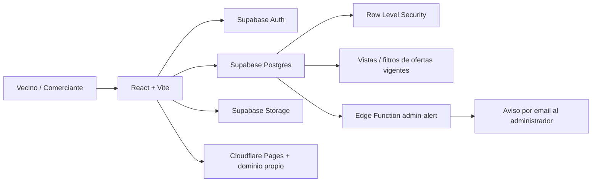

# Cerca Liceo

Guia barrial para que vecinos de Liceo encuentren ofertas vigentes, locales, emprendimientos, horarios, ubicacion y contacto directo por WhatsApp.

Sitio en produccion: [cercaliceo.com.ar](https://www.cercaliceo.com.ar/)

## Por Que Existe

En barrios grandes como Liceo Procrear muchas compras se resuelven por grupos de WhatsApp: comida de la noche, despensa, peluqueria, ferreteria, servicios o emprendimientos sin local. El problema es que la informacion se pierde rapido, las promos quedan mezcladas y el vecino termina preguntando varias veces lo mismo.

Cerca Liceo centraliza esa informacion en una experiencia simple:

- El vecino entra gratis, busca y escribe directo por WhatsApp.
- El comercio carga su ficha gratis para aparecer en la guia.
- Las ofertas duran pocos dias y se bajan solas para evitar publicaciones viejas.
- El administrador revisa locales, activa extras manuales y mantiene la calidad del barrio.

## Funciones Principales

### Vecinos

- Buscar por producto, rubro, local o seccion.
- Ver ofertas activas y comercios abiertos.
- Abrir WhatsApp del comercio sin intermediarios.
- Ver direccion, referencia o pin de Maps cuando el local lo carga.
- Usar la pagina sin crear cuenta.

### Comercios y Emprendedores

- Crear cuenta de comercio.
- Publicar ficha gratuita con nombre, rubro, WhatsApp, zona, horarios y foto.
- Usar la app con local fisico o como emprendimiento sin direccion publica.
- Publicar 1 promo semanal gratis con vencimiento automatico.
- Republicar promos vencidas.
- Ver metricas simples: vistas de ficha, vistas de promos y clicks en WhatsApp.
- Solicitar plan fundador para catalogo, pedidos por WhatsApp y publicaciones extra.

### Administrador

- Ver locales registrados y estado de cada ficha.
- Revisar comercios incompletos.
- Ocultar locales o publicaciones.
- Activar plan fundador manualmente.
- Recibir alertas por email cuando un comercio actualiza o crea una ficha.
- Consultar metricas de visitas y actividad.

## Stack

- Frontend: React + Vite.
- UI: CSS propio optimizado para mobile first.
- Backend: Supabase Auth, Postgres, Storage y Edge Functions.
- Deploy: Cloudflare Pages.
- Dominio: `cercaliceo.com.ar`.

## Arquitectura



## Decisiones Tecnicas

- Use Supabase para avanzar rapido con un backend real, Auth, RLS, Storage y Postgres sin montar un servidor propio desde cero.
- Modele comercios, ofertas, productos y perfiles como entidades separadas porque el dominio no es un CRUD plano.
- Las promos tienen fecha de vencimiento: el feed publico filtra lo vigente para que el vecino no vea ofertas viejas.
- El plan fundador se maneja manualmente porque el proyecto arranca barrial, sin pasarela de pago ni comisiones.
- Se agrego modo compatible Android para evitar problemas de renderizado en celulares de gama baja o navegadores viejos.
- El mapa del home se mantiene liviano; el mapa real aparece donde suma valor: al cargar o abrir la ubicacion de un comercio.

## Flujos Criticos

1. Vecino entra al home y busca una oferta o local.
2. Comerciante se registra y con esos datos se crea una ficha basica.
3. Comerciante completa foto, ubicacion y horarios.
4. Comerciante publica una promo gratis.
5. Admin recibe aviso por email y revisa calidad.
6. Si el comercio pide plan fundador, el admin lo activa manualmente.

## Seguridad Y Privacidad

- Row Level Security en Supabase para separar datos publicos, datos del comerciante y acciones de administrador.
- Cada comercio edita solo su propia ficha y sus publicaciones.
- Las fotos se guardan en Storage, no dentro de la base de datos.
- El vecino puede usar la pagina sin registrarse.
- No se cobra al vecino y no hay pasarela de pago integrada.

## Metricas Que Ya Se Miden

- Visitas a la pagina.
- Vistas de locales.
- Vistas de ofertas.
- Clicks en WhatsApp.
- Cuentas creadas.
- Comercios con ficha completa o incompleta.

Estas metricas sirven tanto para mejorar el producto como para mostrar impacto real del proyecto.

## Desarrollo Local

```bash
npm install
npm run dev
```

Crear `.env.local`:

```env
VITE_SUPABASE_URL=https://TU-PROYECTO.supabase.co
VITE_SUPABASE_ANON_KEY=TU_ANON_KEY_PUBLICA
```

## Scripts

```bash
npm run lint
npm run build
npm run preview
```

## Produccion

Ver [DEPLOY.md](./DEPLOY.md) y [BACKEND.md](./BACKEND.md).

## Roadmap Corto

- Sumar tests automatizados para vencimiento de promos, permisos y limites semanales.
- Separar mejor modulos de UI y logica de negocio.
- Migrar partes sensibles del core a TypeScript.
- Mejorar SEO con prerender o migracion gradual a SSR/SSG.
- Sumar reportes simples para comercios: vistas, clicks y promos que mejor funcionan.

## Contacto

Proyecto creado por Cristian Eduardo Alba, vecino de Liceo Procrear.

- WhatsApp: 351 766 2142
- Email: crisalbavideografo@gmail.com
