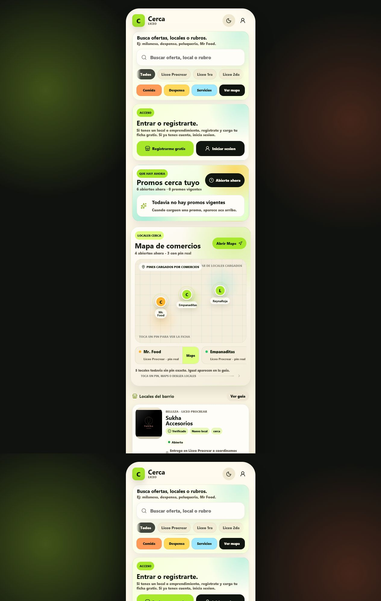
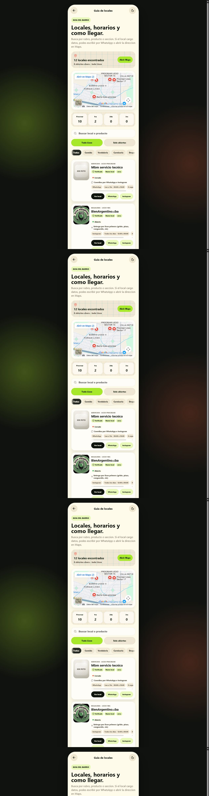
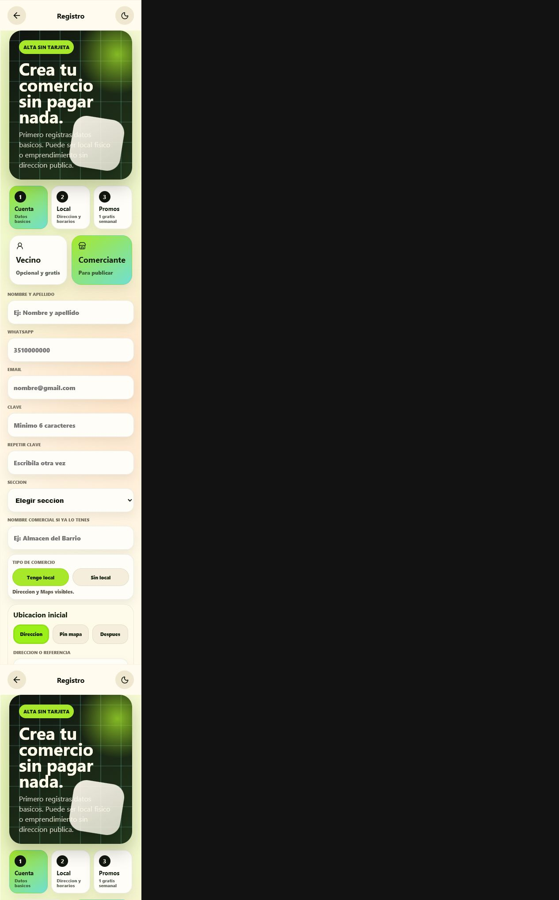
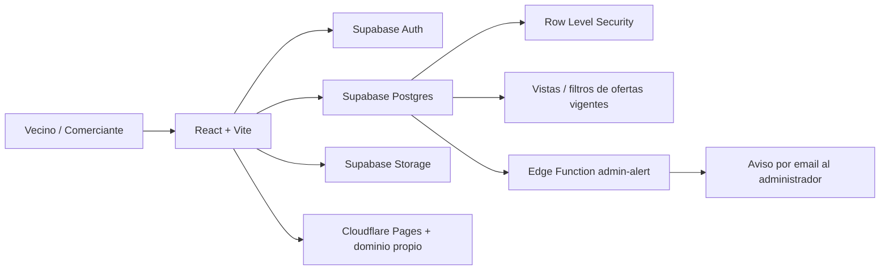

# Cerca Liceo

Gratis hoy y siempre para comerciantes y vecinos de Liceo. Las ofertas del barrio en un solo lugar, para que no se pierdan entre mensajes de WhatsApp. Sin tarjeta, comisiones ni planes pagos.

[](https://www.cercaliceo.com.ar/)
[](https://github.com/cristalba22/cerca-liceo/actions/workflows/quality.yml)
[](https://react.dev/)
[](https://supabase.com/)

## Producto En Uso

La aplicacion esta publicada, usa datos reales y fue pensada mobile first para vecinos y comerciantes con distintos niveles de experiencia digital.

<table>
  <tr>
    <td></td>
    <td></td>
  </tr>
  <tr>
    <td></td>
    <td></td>
  </tr>
</table>

## Por Que Existe

En barrios grandes como Liceo Procrear muchas compras se resuelven por grupos de WhatsApp: comida de la noche, despensa, peluqueria, ferreteria, servicios o emprendimientos sin local. El problema es que la informacion se pierde rapido, las promos quedan mezcladas y el vecino termina preguntando varias veces lo mismo.

Cerca Liceo centraliza esa informacion en una experiencia simple:

- El vecino entra gratis, busca y escribe directo por WhatsApp.
- El comercio carga su ficha gratis para aparecer en la guia.
- Las ofertas duran pocos dias y se bajan solas para evitar publicaciones viejas.
- El administrador revisa locales y mantiene la calidad del barrio, sin activar planes.

## Funciones Principales

### Vecinos

- Buscar por producto, rubro, local o seccion.
- Ver ofertas activas y comercios abiertos.
- Abrir WhatsApp del comercio sin intermediarios.
- Ver direccion, referencia o pin de Maps cuando el local lo carga.
- Usar la pagina sin crear cuenta.

### Comercios y Emprendedores

- Crear cuenta de comercio.
- Publicar ficha gratuita con nombre, rubro, WhatsApp, zona, horarios y foto.
- Usar la app con local fisico o como emprendimiento sin direccion publica.
- Publicar ofertas gratis con vencimiento automatico, sin cupos ligados a planes.
- Republicar promos vencidas.
- Ver metricas simples: vistas de ficha, vistas de promos y clicks en WhatsApp.
- Cargar catalogo y recibir pedidos por WhatsApp, gratis y sin activacion de un plan.

### Administrador

- Ver locales registrados y estado de cada ficha.
- Revisar comercios incompletos.
- Ocultar locales o publicaciones.
- Activar Impulso Liceo manualmente.
- Recibir alertas por email cuando un comercio actualiza o crea una ficha.
- Consultar metricas de visitas y actividad.

## Stack

- Frontend: React + Vite.
- UI: CSS propio optimizado para mobile first.
- Backend: Supabase Auth, Postgres, Storage y Edge Functions.
- Deploy: Cloudflare Pages.
- Dominio: `cercaliceo.com.ar`.

## Arquitectura


```mermaid
flowchart LR
  Vecino["Vecino / Comerciante"] --> Web["React + Vite"]
  Web --> Auth["Supabase Auth"]
  Web --> DB["Supabase Postgres"]
  Web --> Storage["Supabase Storage"]
  DB --> RLS["Row Level Security"]
  DB --> Views["Vistas / filtros de ofertas vigentes"]
  DB --> Function["Edge Function admin-alert"]
  Function --> Email["Aviso por email al administrador"]
  Web --> Cloudflare["Cloudflare Pages + dominio propio"]
```

El frontend mantiene la navegacion y el estado compartido en `src/App.jsx`, mientras que las pantallas estan separadas por dominio:

- `src/screens/PublicScreens.jsx`: guia, ofertas, comercios y detalle publico.
- `src/screens/AuthScreens.jsx`: acceso, registro, recuperacion y perfil.
- `src/screens/MerchantScreens.jsx`: ficha, publicaciones y catalogo del comercio.
- `src/screens/AdminScreen.jsx`: operacion y moderacion administrativa.

## Decisiones Tecnicas

- Use Supabase para avanzar rapido con un backend real, Auth, RLS, Storage y Postgres sin montar un servidor propio desde cero.
- Modele comercios, ofertas, productos y perfiles como entidades separadas porque el dominio no es un CRUD plano.
- Las promos tienen fecha de vencimiento: el feed publico filtra lo vigente para que el vecino no vea ofertas viejas.
- Impulso Liceo se activa manualmente durante el lanzamiento porque el proyecto arranca barrial, sin pasarela de pago ni comisiones.
- Se agrego modo compatible Android para evitar problemas de renderizado en celulares de gama baja o navegadores viejos.
- El mapa del home se mantiene liviano; el mapa real aparece donde suma valor: al cargar o abrir la ubicacion de un comercio.

## Flujos Criticos

1. Vecino entra al home y busca una oferta o local.
2. Comerciante se registra y con esos datos se crea una ficha basica.
3. Comerciante completa foto, ubicacion y horarios.
4. Comerciante publica una promo gratis.
5. Admin recibe aviso por email y revisa calidad.
6. El comercio puede agregar su catalogo y publicar mas ofertas gratis, sin aprobacion de un plan.

## Seguridad Y Privacidad

- Row Level Security en Supabase para separar datos publicos, datos del comerciante y acciones de administrador.
- Cada comercio edita solo su propia ficha y sus publicaciones.
- Las fotos se guardan en Storage, no dentro de la base de datos.
- El vecino puede usar la pagina sin registrarse.
- No se cobra al vecino y no hay pasarela de pago integrada.

## Metricas Que Ya Se Miden

- Visitas a la pagina.
- Vistas de locales.
- Vistas de ofertas.
- Clicks en WhatsApp.
- Cuentas creadas.
- Comercios con ficha completa o incompleta.

Estas metricas sirven tanto para mejorar el producto como para mostrar impacto real del proyecto.

## Desarrollo Local

> Los cambios visuales deben respetar el sistema adaptativo documentado en [`docs/MOTION.md`](docs/MOTION.md). Las reglas obligatorias para asistentes y colaboradores estan en [`AGENTS.md`](AGENTS.md).

```bash
npm install
npm run dev
```

Crear `.env.local`:

```env
VITE_SUPABASE_URL=https://TU-PROYECTO.supabase.co
VITE_SUPABASE_ANON_KEY=TU_ANON_KEY_PUBLICA
```

## Scripts

```bash
npm run lint
npm test
npm run build
npm run preview
```

## Calidad Automatizada

GitHub Actions ejecuta en cada push y pull request:

- Lint del frontend.
- 12 pruebas de reglas de negocio y seguridad.
- Build de produccion.

Las pruebas cubren formato de WhatsApp argentino, vencimiento y pausa de promociones, horarios cortados y especiales de fin de semana, proteccion de notas administrativas y acceso gratuito al catalogo y publicaciones.

### Modelo Gratuito

Aplicar `supabase/free-forever.sql` despues de los scripts anteriores de seguridad y feed publico. Quita condiciones de plan y fechas de pago del catalogo y del RPC de publicaciones anterior, conservando RLS, propiedad y visibilidad. Los campos de planes antiguos se conservan por compatibilidad, pero no conceden ni restringen herramientas. Las ofertas siguen venciendo; las cuentas no tienen periodo de prueba.

## Produccion

Ver [DEPLOY.md](./DEPLOY.md) y [BACKEND.md](./BACKEND.md).

## Roadmap Corto

- Separar mejor modulos de UI y logica de negocio.
- Migrar partes sensibles del core a TypeScript.
- Mejorar SEO con prerender o migracion gradual a SSR/SSG.
- Sumar reportes simples para comercios: vistas, clicks y promos que mejor funcionan.

## Calidad De Produccion

- Playwright recorre home, buscador, accesos y páginas públicas en perfiles iPhone, Android de 360 px y escritorio.
- Axe revisa automáticamente errores serios o críticos de accesibilidad, incluido contraste.
- Una suite protegida por secretos prueba registro, confirmación, foto, ficha y promo con una cuenta descartable.
- Los errores inesperados del navegador se registran y el primer fallo de cada sesión envía un aviso al administrador.
- HEIC/HEIF y fotos de hasta 30 MB se convierten bajo demanda y se reducen antes de subir.
- El build genera una URL, metadata, datos estructurados y sitemap para cada comercio público.
- GitHub Actions puede desplegar a Cloudflare Pages después de aprobar todos los controles.

## Contacto

Proyecto creado por Cristian Eduardo Alba, vecino de Liceo Procrear.

- WhatsApp: 351 766 2142
- Email: crisalbavideografo@gmail.com
